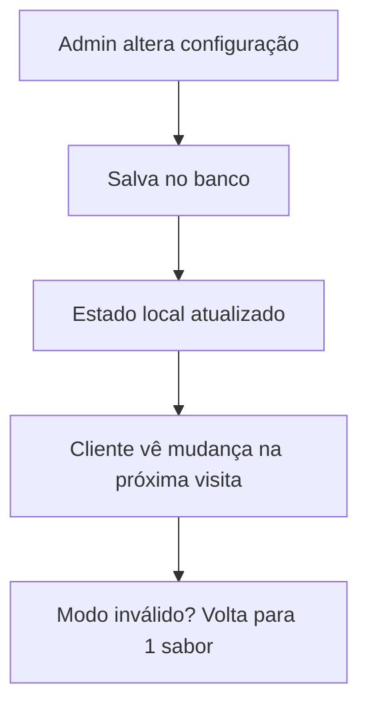

# Sistema de Controle de Opções de Sabores

Esta funcionalidade permite ao administrador controlar dinamicamente quais opções de sabores estão disponíveis para os clientes.

## 📋 Como Funciona

### Painel Administrativo
- **Localização**: `/admin/produtos`
- **Seção**: "Configurações de Sabores" (aparece no topo da página)
- **Controles**: Checkboxes para habilitar/desabilitar cada opção

### Regras de Negócio
- ✅ **1 Sabor**: Sempre habilitado (obrigatório)
- 🔄 **2 Sabores**: Pode ser habilitado/desabilitado pelo admin
- 🔄 **3 Sabores**: Pode ser habilitado/desabilitado pelo admin

## 🎛️ Interface Administrativa

### Card "Configurações de Sabores"
```
┌─────────────────────────────────────────┐
│ Configurações de Sabores                │
├─────────────────────────────────────────┤
│ Configure quais opções estão disponíveis│
│                                         │
│ [1 Sabor]     [Obrigatório] ☑ Habilitado│
│ [2 Sabores]                 ☑ Habilitado│
│ [3 Sabores]                 ☐ Desabilitado│
└─────────────────────────────────────────┘
```

### Características
- **Checkbox desabilitado**: Para 1 sabor (sempre ativo)
- **Badge "Obrigatório"**: Indica que 1 sabor não pode ser desativado
- **Estado visual**: "Habilitado" / "Desabilitado" ao lado de cada opção

## 🔄 Funcionamento Dinâmico

### No Frontend Público
1. **Filtragem automática**: Apenas opções ativas aparecem nos botões
2. **Texto dinâmico**: "Você pode escolher até X sabores" se ajusta automaticamente
3. **Validação inteligente**: Se o usuário está em modo desabilitado, volta para 1 sabor

### Fluxo de Atualização


## 💾 Estrutura de Dados

### Tabela `opcoes_sabores`
```sql
CREATE TABLE opcoes_sabores (
  id UUID PRIMARY KEY,
  nome VARCHAR(50) NOT NULL,        -- "1 Sabor", "2 Sabores", etc.
  maximo_sabores INTEGER NOT NULL,  -- 1, 2, 3
  descricao TEXT,
  ordem INTEGER DEFAULT 0,
  ativo BOOLEAN DEFAULT true,       -- Campo controlado pelo admin
  created_at TIMESTAMP DEFAULT NOW()
);
```

### Dados Iniciais
```sql
INSERT INTO opcoes_sabores (nome, maximo_sabores, descricao, ordem, ativo) VALUES 
('1 Sabor', 1, 'Pizza com apenas um sabor', 1, true),
('2 Sabores', 2, 'Pizza dividida com dois sabores', 2, true),
('3 Sabores', 3, 'Pizza dividida com tres sabores', 3, true);
```

## 🎯 Casos de Uso

### Cenário 1: Desabilitando 3 Sabores
1. Admin vai em `/admin/produtos`
2. Desabilita checkbox "3 Sabores"
3. Cliente só vê opções de 1 e 2 sabores

### Cenário 2: Apenas 1 Sabor
1. Admin desabilita "2 Sabores" e "3 Sabores"
2. Cliente vê apenas botão "1 Sabor"
3. Interface fica simplificada

### Cenário 3: Cliente em Modo Inválido
1. Cliente estava selecionando 3 sabores
2. Admin desabilita "3 Sabores"
3. Na próxima visita, cliente volta automaticamente para 1 sabor

## 🔧 Implementação Técnica

### Componentes Afetados
- `app/admin/produtos/page.tsx` - Interface de controle
- `app/page.tsx` - Filtragem dinâmica no frontend
- `scripts/04-populate-sabores.sql` - Dados iniciais

### Função de Toggle
```typescript
const handleToggleOpcaoSabor = async (opcaoId: string, novoStatus: boolean) => {
  // Atualiza no banco
  await supabase
    .from("opcoes_sabores")
    .update({ ativo: novoStatus })
    .eq("id", opcaoId)
  
  // Atualiza estado local
  setOpcoesSabores(prev => 
    prev.map(opcao => 
      opcao.id === opcaoId ? { ...opcao, ativo: novoStatus } : opcao
    )
  )
}
```

### Filtragem no Frontend
```typescript
// Mostra apenas opções ativas
{opcoesSabores.filter(opcao => opcao.ativo).map((opcao) => (
  // Renderiza botão de seleção
))}
```

## 🚨 Validações e Proteções

### Proteções Implementadas
1. **1 Sabor sempre ativo**: Checkbox desabilitado no admin
2. **Fallback inteligente**: Se modo atual fica inativo, volta para 1 sabor
3. **Validação de estado**: Verifica consistência a cada carregamento
4. **Dados mock**: Funciona mesmo sem Supabase configurado

### Tratamento de Erros
- Se falha ao carregar: usa dados padrão (todos ativos)
- Se falha ao salvar: mantém estado anterior
- Se inconsistência: força volta para 1 sabor

## 📱 Experiência do Cliente

### Interface Adaptável
- **Todos ativos**: Vê 3 botões (1, 2, 3 sabores)
- **2 desabilitado**: Vê apenas 1 e 3 sabores
- **Só 1 ativo**: Interface simplificada

### Feedback Visual
- Botões se ajustam dinamicamente
- Texto atualiza automaticamente
- Sem elementos "quebrados" ou confusos

## 🎉 Benefícios

1. **Controle total**: Admin decide quais opções oferecer
2. **Flexibilidade**: Pode simplificar ou complexificar conforme necessário
3. **Experiência consistente**: Cliente nunca vê opções inválidas
4. **Fácil de usar**: Interface intuitiva no painel admin
5. **Prova de falhas**: Sistema robusto com fallbacks

---

**Resultado**: Sistema completo que permite controle granular das opções de sabores, com interface administrativa simples e experiência do cliente sempre consistente. 